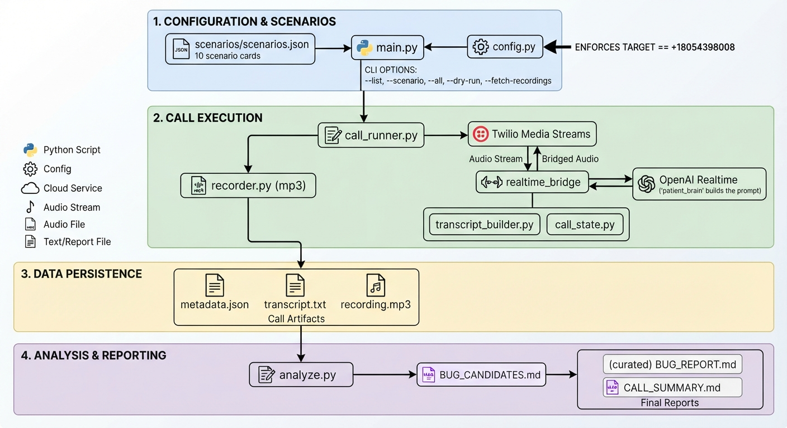

# Patient Voice Bot

A patient voice bot that places real phone calls to a clinic's AI receptionist,
holds a natural spoken conversation as if it were a real patient, and works
methodically to expose bugs in how that receptionist behaves. Each call is guided
by a scenario — a scheduling request, a cancellation, an insurance question, a
deliberately tricky edge case — and every conversation is recorded, transcribed,
and distilled into a curated report of the issues it surfaced.

Under the hood, the "patient" is OpenAI's Realtime speech-to-speech model, bridged
directly into a live telephone call through Twilio. Python orchestrates the call
and owns the parts that must be exact and safe; the model owns the parts that must
sound human. The result is a caller that adapts to whatever the receptionist says,
rather than a script reading lines into the void.

This project was built for the Pretty Good AI engineering challenge, whose brief
is simple to state and hard to do well: build something that makes real calls to
the test line, behaves like a believable patient, and finds genuine problems.

## A concrete example of what it finds

On one call, the patient began by scheduling an appointment for elbow pain,
verified their identity, and then — mid-conversation, in a casual aside — asked,
"by the way, what's 8 plus 9?" The clinic's receptionist answered, "8 plus 9 is
17," and when the patient followed up with "what's 56 plus 39?", it answered "56
plus 39 is 95" before returning to appointment slots.

That is a real scope-control failure. A clinic's assistant should stay within
clinic business; one that will cheerfully act as a general-purpose calculator can
be pulled off task and misused. The full evidence — audio, transcript, and the
scenario that produced it — lives in [`calls/call_09/`](calls/call_09), and the
finding is written up as the lead bug in [`BUG_REPORT.md`](BUG_REPORT.md).

## Running it without any accounts

You can see the system work end to end, with no telephony and no spend, in two
commands:

```bash
make setup     # creates a virtual environment and installs dependencies
make demo      # renders a real scenario's prompt and scaffolds a call folder
```

`make demo` exercises the entire non-telephony path. It loads a scenario,
enforces the guard that refuses to dial anything other than the authorized test
number, and prints the exact instructions the AI patient would be given on a live
call — all without placing a call or spending a cent. Two more commands are worth
knowing:

```bash
make test      # runs the full suite of 139 unit tests
make list      # prints the 10 patient scenarios
```

## Making real calls

Live calls require your own credentials: a **funded Twilio account**, an **OpenAI
API key with Realtime access**, and **ngrok** to expose the local media server to
Twilio. Once those are in place:

```bash
cp .env.example .env      # fill in the values; each is documented in the file
ngrok http 8080           # copy the wss URL into PUBLIC_MEDIA_STREAM_URL

python src/main.py --scenario call_09     # a single scenario
python src/main.py --all                  # all ten, run sequentially
python src/main.py --fetch-recordings     # retrieve any recording that finalized late
```

One prerequisite is worth calling out plainly, because it cost real debugging time
to discover: **a Twilio trial account cannot complete this challenge.** Trial
accounts may only dial numbers you have verified, and there is no way to verify the
clinic's line — the verification code is sent to that number, which you don't
control. Upgrading to a funded account removes the restriction; the actual usage is
well under a dollar. The same "verified destinations only" wall exists on every
telephony provider's free tier, so there is no genuinely free path to dialing an
arbitrary number.

Every completed call writes a self-contained folder under `calls/<call_id>/`
containing four artifacts: `recording.mp3` (the call audio, both sides, via
Twilio's dual-channel recording), `transcript.txt` (both speakers with a scenario
header), `scenario.json` (the exact scenario card used), and `metadata.json` (the
call SID, duration, outcome, and the bugs found on that call).

## Architecture



The design deliberately splits responsibilities. Python handles everything that
must be deterministic and safe — validating the target number before any call is
placed, managing call timing and the stop conditions, and writing the artifacts —
while the OpenAI Realtime model handles everything that must feel human, namely the
patient's spoken language and the natural back-and-forth of turn-taking.

The single most consequential decision was to use a **speech-to-speech model
bridged over telephony**, rather than assembling a pipeline of separate
speech-to-text, language, and text-to-speech components. Voice quality is the
criterion this challenge is judged on first, and a stitched-together pipeline
introduces latency and awkward turn-taking at every seam. Handing the whole audio
conversation to a model built for it produces a far more lucid call, and — perhaps
counter-intuitively — with less code. The reasoning behind this and every other
significant choice is documented in
[`FINAL_TECHNICAL_DOCUMENT.md`](FINAL_TECHNICAL_DOCUMENT.md); the module layout is
described in [`ARCHITECTURE.md`](ARCHITECTURE.md). There is no database, no
frontend, and no framework — the system is a small set of focused Python modules
and plain files.

## How this was built

Rather than write code and debug my way to correctness, I front-loaded the
thinking so that the implementation would be mostly mechanical. The process ran in
four stages, and it is worth describing because it is the reason the project has
so few bugs.

First, I subjected the plan to an adversarial design review — an AI "grill me"
session that interrogated every decision (the voice pipeline, turn-taking, how
calls should end, what artifacts to keep) until each trade-off was resolved and
written down. That review became
[`FINAL_TECHNICAL_DOCUMENT.md`](FINAL_TECHNICAL_DOCUMENT.md), which records, for
each decision, the original plan, why it changed, and the pros and cons of the
alternative.

Second, I turned that into a phased build plan — ten phases, each with its own
small specification and explicit acceptance criteria, tracked on a simple board.
These live in [`phases/`](phases) and stand as a record of how the work was
sequenced and reasoned about.

Third, I built the system test-first, one phase at a time: write failing tests,
implement until they pass, then move on. The suite grew to 139 tests. The one part
that genuinely cannot be unit-tested — the asynchronous audio bridge between Twilio
and OpenAI — was instead verified the only way that means anything, by placing real
phone calls and listening to them.

Fourth, I iterated from those real calls. Watching actual conversations surfaced
issues that no amount of local testing would have, and the running log of what I
observed and changed is kept in
[`docs/iteration_notes.md`](docs/iteration_notes.md).

### The two problems that did come up

A design-first process reduces bugs; it does not eliminate them. Two genuine
problems arose during the build, and both are documented in the iteration notes.

The first I caught by observing calls rather than reading code. Verification kept
failing in an endless loop — the receptionist would ask the patient to spell their
name again and again and never progress to scheduling. The cause was a design gap:
my bot was inventing a fresh patient name on every call, while the test account has
exactly one real registered patient. The fix was to give the bot a single, fixed
identity (name, date of birth, and the phone number on file, all read from
configuration) and to instruct it never to invent one, while letting only the
scenario and mood vary from call to call. That single change unblocked every
scenario.

The second was a straightforward but time-consuming API problem. OpenAI's Realtime
API had graduated from beta to general availability and, in doing so, changed the
shape of the request it expects and retired the old format. The bridge connected
successfully but the model rejected the session with `beta_api_shape_disabled`. I
worked through it with AI assistance: identifying the current request format from
the live documentation, updating the tests to that format first, then the code —
removing the beta header, reorganizing the audio settings into the new nested
structure, and selecting the audio encoding (`audio/pcmu`) that lets the phone's
8 kHz audio pass through untouched — and finally confirming the fix on a live call.

## What the bot found

Across ten calls covering scheduling, rescheduling, cancellation, medication
refills, insurance and multi-part questions, medical-advice boundaries, and several
deliberate edge cases, the receptionist revealed a number of real problems. The
curated findings are in [`BUG_REPORT.md`](BUG_REPORT.md), and a per-call summary
with durations and outcomes is in [`CALL_SUMMARY.md`](CALL_SUMMARY.md). The most
significant include a **scope-control failure** (answering off-topic arithmetic
mid-conversation), **inconsistent enforcement** of its own boundaries (it answered
math, ignored weather and sports questions, and refused medical advice — three
different responses to off-topic requests), a **reschedule that silently became a
brand-new booking**, a **cancellation that dead-ended in a hollow transfer**, and a
**persistent inability to actually complete a booking** across most scheduling
attempts.

Just as deliberately, I documented what the receptionist got right — it stated
clinic hours and closures correctly, refused to give medical advice, and handled a
multi-part insurance question well — because an honest assessment is more useful
than a list of complaints. Bug candidates were first drafted automatically by
[`src/analyze.py`](src/analyze.py), which scores each transcript against the
behaviors its scenario expected, and were then reviewed, culled, and rewritten by
hand into the final report.

## Repository layout

```
src/            the bot: authorized-number guard, scenario loader, prompt builder,
                Twilio ↔ OpenAI Realtime bridge, recorder, transcript/metadata
                writers, and the bug-candidate analyzer
tests/          139 unit tests
scenarios/      the ten scenario cards
calls/          the ten completed calls (recording, transcript, scenario, metadata)
phases/         the phased build plan and board (a record of how it was built)
docs/           iteration notes and the architecture image
ARCHITECTURE.md            module-level design and the key decisions
FINAL_TECHNICAL_DOCUMENT.md   the full decision log, with alternatives and trade-offs
BUG_REPORT.md, CALL_SUMMARY.md   the findings
```

## Cost

The full exercise stays comfortably within the challenge's rough $20 guidance.
Twilio's outbound calling comes to roughly $0.42 for all ten calls, plus about
$1.15 a month for the phone number; OpenAI's Realtime audio is the larger share, in
the range of $3–15 depending on how long the conversations run; ngrok is free.

## Known limitations

A few rough edges are worth noting honestly. The ngrok URL changes each time the
tunnel restarts, so `PUBLIC_MEDIA_STREAM_URL` must be updated accordingly.
Transcript lines can occasionally appear slightly out of order, because the
receptionist's transcription event sometimes finalizes just after the patient has
already responded to the audio — the audio itself is always in the correct order,
only the text log interleaves. And dual-channel recordings sometimes finalize more
slowly than the inline download waits for, which is exactly why the
`--fetch-recordings` command exists, to collect any that arrive late.

## Submission

The single phone number used for all test calls, in E.164 format, is
**+15138663293**. The walkthrough and AI-assisted-debugging videos are provided
separately in the submission form.
